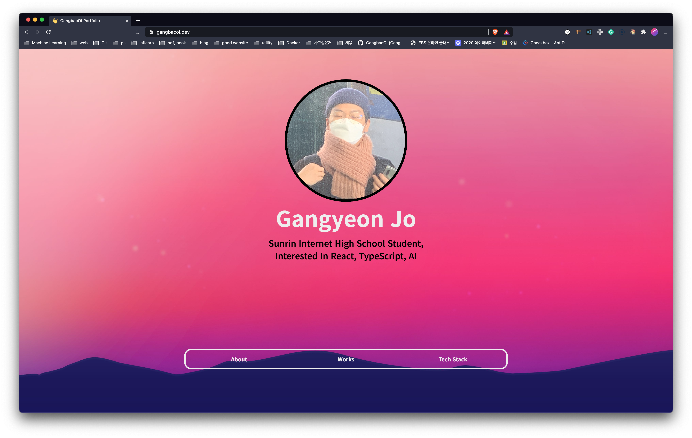
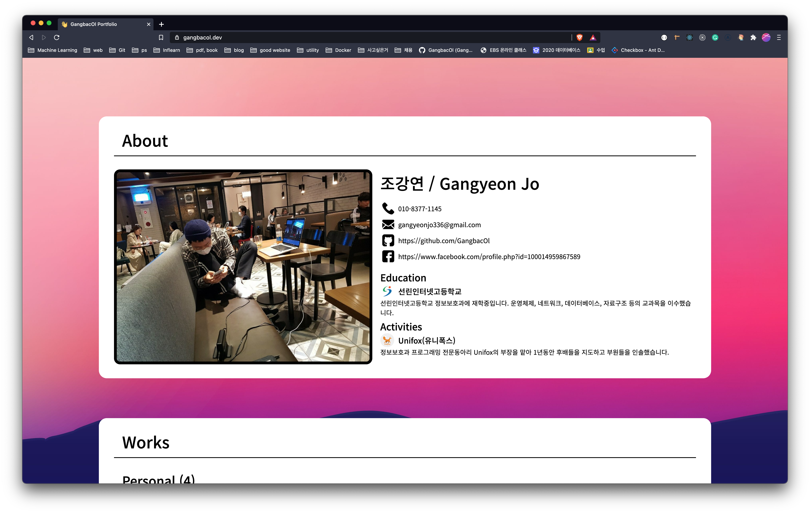
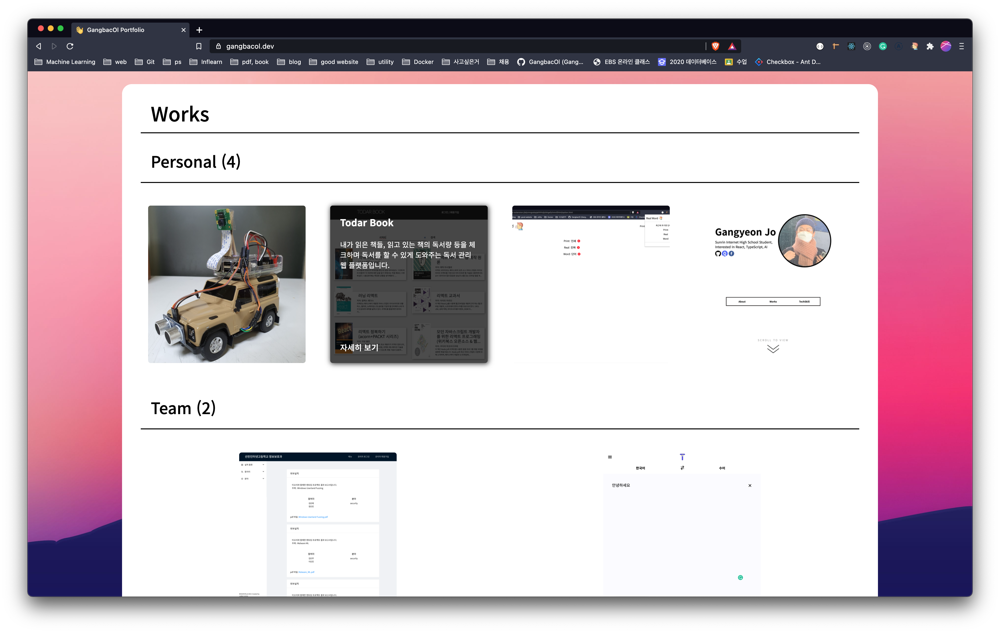
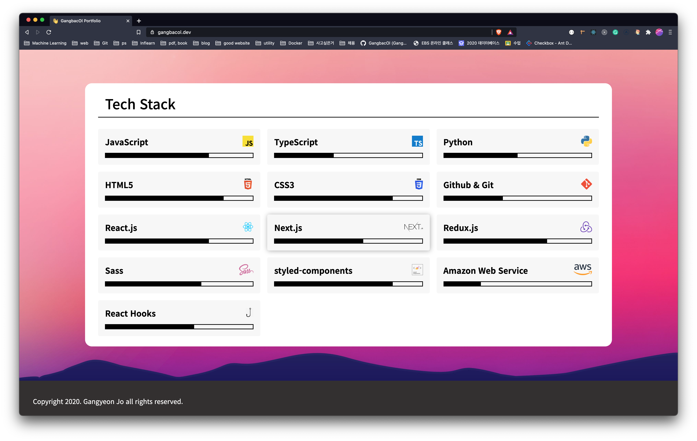

# portfolio-page

[Notion Link ✈](https://www.notion.so/Gangyeon-Jo-s-Portfolio-07db7894fda84255953a50945709f046?p=97184c97e8e94d38a72de89a32538346)

    
    
    
    

## Tech Stack

-   **프론트엔드**
    -   JavaScript
    -   React.js
    -   Next.js
    -   styled-components
-   **배포**
    -   Vercel(CI/CD)
